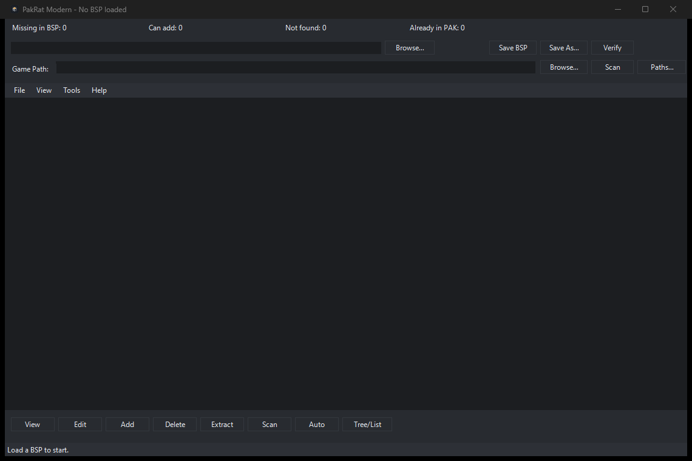

# PakRat Modern

Modern PakRat-style tool for editing the `PAKFILE` lump inside Source `.bsp` maps.



It includes:
- Native Windows GUI
- CLI for scripting and automation
- Built `.exe` launcher for everyday use

## GUI

Recommended launch options:

1. Run the compiled app:

```text
PakRatModern.exe
```

2. Or run the PowerShell GUI script directly:

```powershell
powershell -ExecutionPolicy Bypass -File .\pakrat_modern_gui.ps1
```

Quick workflow:
1. Open a `.bsp` and it loads automatically
2. Set `Game Path`
3. Click `Scan`
4. Review missing files and use `Add all` or `Add all + Save`
5. Save in place or use `Save As...`

Main GUI features:
- PakRat-style embedded file list with `In`, `Name`, `Path`, `Size`, `Type`
- Dark theme UI
- Sortable list headers
- Tree/List toggle
- Add files and folders
- Drag and drop support
- Edit internal PAK paths
- Delete selected entries
- Extract selected entries
- PAK verification
- Scan map references from BSP data
- Skip files that are already shipped in the selected game's base VPKs and `gameinfo.txt` search paths
- Auto-add addable missing files
- Scan summary bar: missing, addable, not found, already in PAK
- Export scan results to `.txt`
- Remembered game paths with path manager
- Optional `.bak` backup before in-place save

## Scan extras

Optional extras currently checked by scan:
- `maps/<mapname>.nav`
- `maps/<mapname>.txt`
- `resource/overviews/<mapname>.txt`
- `resource/overviews/<mapname>.dds`
- `resource/overviews/<mapname>_radar.dds`
- `materials/overviews/<mapname>.vmt`
- `materials/overviews/<mapname>.vtf`
- `materials/overviews/<mapname>_radar.vmt`
- `materials/overviews/<mapname>_radar.vtf`

## CLI

Main CLI script:
- [pakrat_modern.py](pakrat_modern.py)

PowerShell wrapper:
- [pakrat_modern.ps1](pakrat_modern.ps1)

The wrapper uses local Python 3 when available and falls back to WSL `python3`.

Examples:

```powershell
powershell -ExecutionPolicy Bypass -File .\pakrat_modern.ps1 list C:\path\map.bsp
powershell -ExecutionPolicy Bypass -File .\pakrat_modern.ps1 verify C:\path\map.bsp
powershell -ExecutionPolicy Bypass -File .\pakrat_modern.ps1 extract C:\path\map.bsp --out C:\path\pak_out
powershell -ExecutionPolicy Bypass -File .\pakrat_modern.ps1 add C:\path\map.bsp C:\path\materials --base C:\path\materials --out C:\path\map_packed.bsp
powershell -ExecutionPolicy Bypass -File .\pakrat_modern.ps1 remove C:\path\map.bsp materials/custom/test.vmt --out C:\path\map_stripped.bsp
```

## Build the EXE

Build script:
- [build_pakrat_modern_gui.ps1](build_pakrat_modern_gui.ps1)
- [build_release.ps1](build_release.ps1)

Manual build:

```powershell
powershell -ExecutionPolicy Bypass -File .\build_pakrat_modern_gui.ps1
powershell -ExecutionPolicy Bypass -File .\build_release.ps1
```

Output files:
- `PakRatModern.exe`
- `PakRatModern.exe.config`

Release package:
- `release\PakRatModern\`
- `release\PakRatModern-release.zip`
- `release\PakRatModern\PakRat Modern.lnk`

## Safety and compatibility

- Does not rebuild the whole BSP from scratch
- Updates `PAKFILE` and adjusted lump offsets only
- Blocks unsafe PAK resize if `LUMP_GAME_LUMP` is after the PAK lump
- Prevents unsafe extraction paths like `../`
- Blocks unsafe Windows path characters in internal PAK paths
- Applies size and entry-count limits while reading packed ZIP data
- Supports validation before saving
- Supports optional `.bak` backup for in-place save
