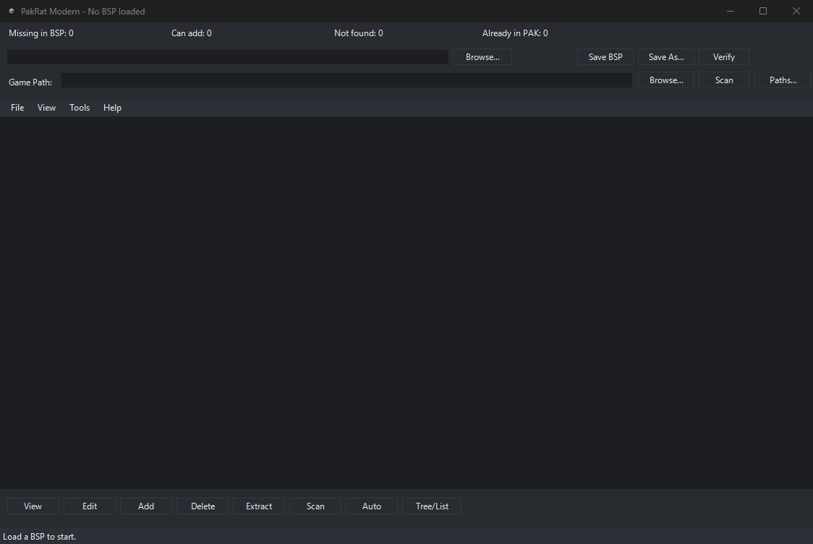

# PakRat Modern

Modern PakRat-style tool for editing the `PAKFILE` lump inside Source `.bsp` maps.



It includes:
- Native Windows GUI (compiled .NET application)
- CLI for scripting and automation

## Install and run

Download `PakRatModern-release.zip` from the
[releases page](https://github.com/Ayrton09/PakRatModern/releases/latest),
extract it anywhere and run:

```text
PakRatModern.exe
```

No runtime to install: the app targets .NET Framework 4.7.2, which ships with
Windows 10 April 2018 Update and later, and is a free download for older
versions. That is the same requirement the previous releases had.

### Verifying the download

Each release lists the SHA256 of the zip and of the binaries inside it. To check
what you downloaded matches:

```powershell
Get-FileHash .\PakRatModern-release.zip -Algorithm SHA256
```

GitHub also records a digest for the asset itself, which can be read without
downloading it:

```powershell
gh api repos/Ayrton09/PakRatModern/releases/latest --jq ".assets[].digest"
```

## GUI

Quick workflow:
1. Open a `.bsp` and it loads automatically
2. Set `Game Path` (the folder containing `gameinfo.txt`, e.g. `cstrike` or `hl2`)
3. Click `Scan`
4. Review missing files and use `Add checked` or the `Auto` button
5. Save in place or use `Save As...`

Main GUI features:
- PakRat-style embedded file list with `Name`, `Path`, `Size`, `Type`
- Dark theme
- Sortable list headers
- Tree/List toggle
- Add files and folders
- Drag and drop support
- Edit internal PAK paths
- Delete selected entries
- Extract selected entries
- View entry contents (text or hex)
- PAK verification
- Scan map references from BSP data
- Skip files that are already shipped in the selected game's base VPKs and `gameinfo.txt` search paths
- Auto-add addable missing files
- Scan summary bar: missing, addable, not found, already in PAK
- Export scan results to `.txt`
- Remembered game paths with path manager
- Optional `.bak` backup before overwriting a BSP

Settings and the startup log live in `%LOCALAPPDATA%\PakRatModern\`.

## What the scan looks for

References are collected from three places, because no single one is complete:
- the entity lump (props, skybox, decals, sprites)
- the texdata string table (materials used by the map geometry)
- the static prop game lump (models placed in the editor, which are not entities)

Each reference is then expanded: a `.mdl` pulls in its materials and companion
files (`.vvd`, `.phy`, `.vtx`), and a `.vmt` pulls in its textures and any
material it includes.

Optional extras checked by scan:
- `maps/<mapname>.nav`
- `maps/<mapname>.txt`
- `resource/overviews/<mapname>.txt`
- `resource/overviews/<mapname>.dds`
- `resource/overviews/<mapname>_radar.dds`
- `materials/overviews/<mapname>.vmt`
- `materials/overviews/<mapname>.vtf`
- `materials/overviews/<mapname>_radar.vmt`
- `materials/overviews/<mapname>_radar.vtf`

## CLI

Main CLI script:
- [pakrat_modern.py](pakrat_modern.py)

PowerShell wrapper:
- [pakrat_modern.ps1](pakrat_modern.ps1)

The wrapper uses local Python 3 when available and falls back to WSL `python3`.

Examples:

```powershell
powershell -ExecutionPolicy Bypass -File .\pakrat_modern.ps1 list C:\path\map.bsp
```

```powershell
powershell -ExecutionPolicy Bypass -File .\pakrat_modern.ps1 verify C:\path\map.bsp
```

```powershell
powershell -ExecutionPolicy Bypass -File .\pakrat_modern.ps1 extract C:\path\map.bsp --out C:\path\pak_out
```

```powershell
powershell -ExecutionPolicy Bypass -File .\pakrat_modern.ps1 add C:\path\map.bsp C:\path\materials --base C:\path\materials --out C:\path\map_packed.bsp
```

```powershell
powershell -ExecutionPolicy Bypass -File .\pakrat_modern.ps1 remove C:\path\map.bsp materials/custom/test.vmt --out C:\path\map_stripped.bsp
```

The GUI and the CLI produce byte-identical PAK data for the same set of files.

## Building

Requires the [.NET SDK](https://dotnet.microsoft.com/download).

```powershell
powershell -ExecutionPolicy Bypass -File .\build_release.ps1
```

That publishes the application, packages `release\PakRatModern\` plus
`release\PakRatModern-release.zip`, and prints the SHA256 of the outputs.

### Layout

```text
src/PakRatModern.Core/    BSP, PAK/ZIP, VPK, gameinfo, reference scanner
src/PakRatModern.App/     WinForms interface
pakrat_modern.py          CLI
pakrat_modern_gui.ps1     previous PowerShell GUI, superseded by src/PakRatModern.App
```

## Safety and compatibility

- Does not rebuild the whole BSP from scratch
- Updates `PAKFILE` and adjusted lump offsets only
- Pads the PAK so every following lump keeps its 4-byte alignment
- Blocks unsafe PAK resize if `LUMP_GAME_LUMP` is after the PAK lump
- Writes atomically: a failure mid-save leaves the original BSP intact
- Prevents unsafe extraction paths like `../`
- Blocks unsafe Windows path characters and reserved names in internal PAK paths
- Applies size and entry-count limits while reading packed ZIP data
- Treats internal paths as case-insensitive, like the engine does
- Supports validation before saving
- Supports optional `.bak` backup before overwriting

### Limitations

Some maps store their PAK entries with LZMA. The GUI cannot read those, because
it relies on the ZIP support built into .NET, which handles only Stored and
Deflate. Such a map is refused with an explanation rather than opened partially,
since opening it partially would drop those files on save.

The CLI does read LZMA. Running an `add` with it rewrites every entry
uncompressed, after which the GUI opens the map normally.

## Antivirus false positives

Releases up to 1.2.2 shipped a PowerShell script packaged into an executable
with `ps2exe`. That produces a binary whose only job is to host PowerShell and
run an embedded script, which is the same shape as real malware droppers, so
heuristic engines flagged it regardless of what the script did.

Since 1.3.0 the application is a normal compiled .NET assembly. It contains no
embedded script, does not host PowerShell, and references no networking or
registry APIs.

If a scanner still flags it, please report it as a false positive and open an
issue with the detection name.
